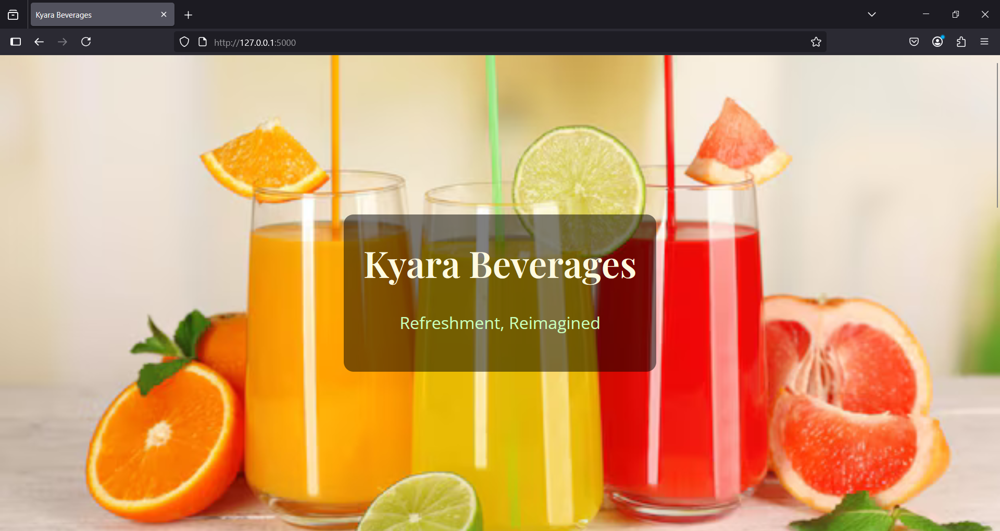
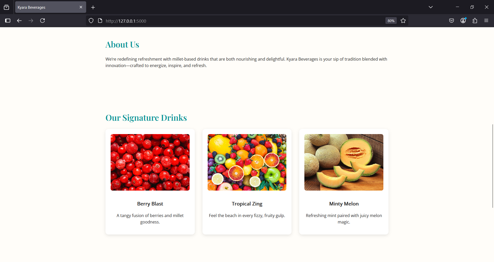
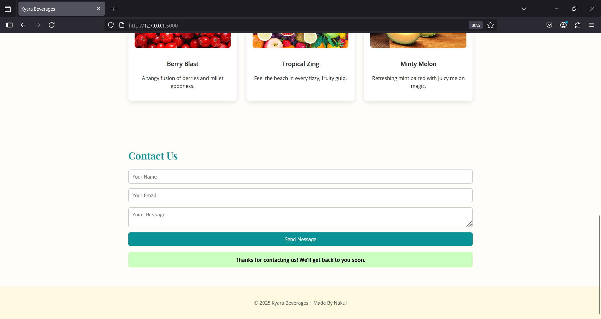

# Kyara Beverages

🌿 A responsive homepage for **Kyara Beverages** built with HTML, CSS, and Flask.
---

## ✨ Features

- ✅ Hero banner with brand logo and tagline
- ✅ About section explaining Kyara’s mission
- ✅ Product teaser section (3 drinks with image + description)
- ✅ Contact form with name, email, and message
- ✅ Flask backend to capture and display form submissions
- ✅ Flash message for confirmation
- ✅ Fully responsive on mobile and desktop

---

## 🛠 Tech Stack

- HTML5 + CSS3
- Python Flask (lightweight backend)
- Google Fonts

---

## 🚀 How to Run Locally

1. Clone the repo:
    
   git clone https://github.com/Nakul-Nimbekar/Kayra-Beverages.git
    
   cd Kayra-Beverages

3. Install dependencies:
   pip install -r requirements.txt

4. Run the Flask app:
   python app.py

## 📸 Screenshots

### 🏠 Homepage Hero Section

### 🧃 Product Teasers

### ✉️ Contact Form

## 🌐 Live Preview
 ⚠️ A Quick Heads-Up

Since the site is hosted for free on Render, it might take a little longer to load if you’re visiting it after some time (Render puts inactive sites to sleep to save resources). Don’t worry — once it wakes up, everything runs smoothly!

🔗 [https://kayra-beverages.onrender.com](https://kayra-beverages.onrender.com)

## 🙋‍♂️ Author
Nakul Nimbekar
[https://github.com/Nakul-Nimbekar](https://github.com/Nakul-Nimbekar)

